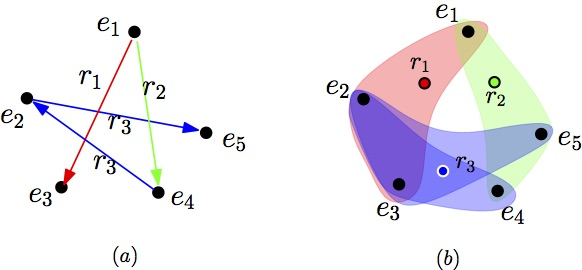



## Efficient Parallel Translating Embedding For Knowledge Graphs

<h1> Date </h1>
<ul>2017/01 - 2017/03</ul>
<h1>Authors</h1> <ul><b>Denghui Zhang</b>, Manling Li, Yantao Jia, Yuanzhuo Wang, Xueqi Cheng</ul>
<!--<h1> Sponsored by </h1>
<ul> Collaborative Research Program of Chinese Academy of Sciences and Huawei Inc. (one of the world's top 500 companies).</ul>-->
<h1>Paper</h1>
<ul>
[<a href='docs/ParTransX.pdf'>PDF</a>]
</ul>
<h1>Problem</h1> 
<ul>
Knowledge graph embedding aims to embed entities and relations of knowledge graphs into low-dimensional vector spaces. 
Translating embedding methods regard relations as the translation from head entities to tail entities, which achieve the state-of-the-art results among knowledge graph embedding methods.
However, a major limitation of these methods is the time consuming training process,  which may take several days or even weeks for large knowledge graphs, and result in great difficulty in practical applications. 
</ul>
<h1>This Paper</h1>
<ul>
In this paper, we propose an efficient parallel framework for translating embedding methods, called ParTrans-X, which enables the methods to be paralleled without lock by utilizing the distinguished structures of knowledge graphs. 
<!--Experiments on two datasets with three typical translating embedding methods, and a more efficient variant TransE- AdaGrad validate that ParTrans-X can speed up the training process by more than an order of magnitude.-->
</ul>
<h1>Major Work</h1> 
<ul>
<li> Modeled the training data of knowledge graph as hypergraph. </li>
<li> Proved the validality of ParTransX mathematically by emploring the law of collisions emerging. </li>
<li> Conducted experiments to demonstrate the superiority of ParTransX framework. </li>
<li> Applied ParTransX successfully in a project of Huawei Inc. (Detail information is disclosed). </li>
<li> This paper was accepted as a reguler paper in WI 2017.</li>
</ul>

