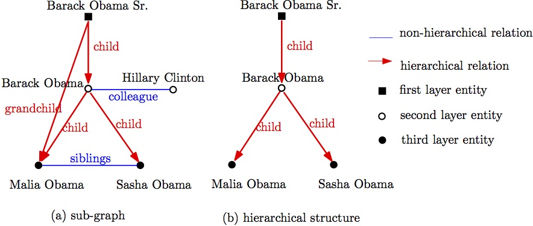



## Link Prediction in Knowledge Graphs: A Hierarchy-Constrained Approach

<h1> Date </h1>
<ul>2016/10 - 2017/03</ul>
<h1>Authors</h1> <ul>Manling Li, <b>Denghui Zhang</b>, Yantao Jia, Yuanzhuo Wang, Xueqi Cheng</ul>
<h1>Paper</h1>
<ul>
[<a href='docs/TBD-2017-02-0077.pdf'>PDF</a>]
</ul>
<h1>Problem</h1> 
<ul>
50% triples in knowledge graphs are organized in hierarchical structures, which also contain rich inference patterns to predict links but do not be fully used. A main feature of hierarchical structure is multi-layer, which traditional methods fails to make use of.
</ul>
<h1>My Work</h1> 
<ul>
<li> Participated in dividing the hierarchical structures into two categories, i.e., single-step hierarchical structures and multi-step hierarchical structures.</li>
<li> Participated in proposing a link prediction method based on knowledge graph embedding, called <b>hTransM</b>, which can separate negative and positive examples by using single-step and multi-step specific margin. </li>
<li> Conducted the experiment on three datasets to demonstrate the effectiveness of hTransM.</li>
<li> The paper was submitted to IEEE Transaction on Big Data (Second Author) and under review now. </li>
</ul>

