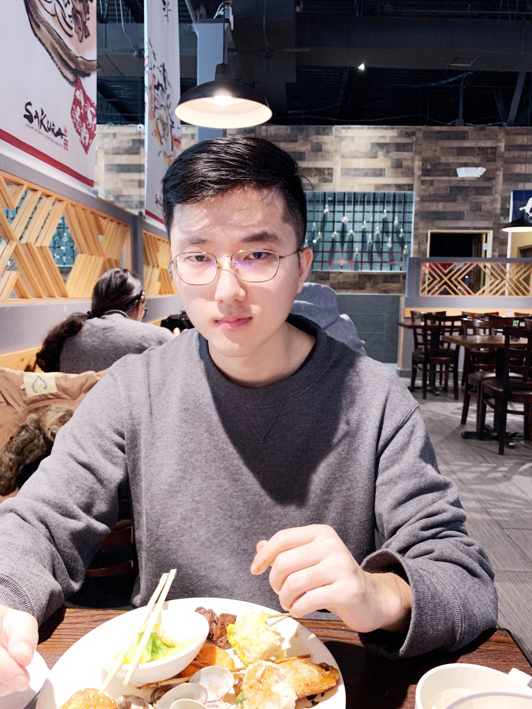



<!--  -->

<!-- Bachelor 
University of Science & Technology Beijing     -->
Ph.D. Candidate  

<!-- [CAS Key Lab of Network Data Science and Technology](http://www.bigdatalab.ac.cn/lab/lab/english)  
[Institute of Computing Technology](http://www.ict.ac.cn/)  
[Chinese Academy of Sciences](http://www.cas.cn/) -->  

<a href='http://datamining.rutgers.edu/CDMBA/'>Rutgers Data Mining and Business Analytics</a> 
<a href='https://www.rutgers.edu/'>Rutgers University</a> 
<!-- <a href='http://www.cas.cn/'>Chinese Academy of Sciences</a>  -->

<!-- No.6 Kexueyuan South Road Zhongguancun    -->
<!-- Haidian District, Beijing, China 100190    -->
Email: <a href="mailto:denghui.zhang@rutgers.edu">x.y@rutgers.edu</a> where x=denghui, y=zhang 
Phone: (+1)862-315-8748  

 <h1 id='bio'>Education</h1>

  <b>Ph.D.</b> in Machine Learning. 2018-2023 
  Rutgers, The State University of New Jersey. 
  Advisor: Prof. <a href='https://scholar.google.com/citations?user=cVDF1tkAAAAJ&hl=en'>Hui Xiong</a>  
  <b>M.S.</b> in Computer Science. 2015-2018 
  Institute of Computing Technology, Chinese Academy of Sciences. 
  Advisor: <a href='http://www.bigdatalab.ac.cn/~junxu/'>Prof. Jun Xu</a>  
  <b>B.E.</b> in Comunication Engineering. 2011-2015 
  University of Science & Technology Beijing.
  <!-- I am a second year Ph.D. student in Rutgers University, my advisor is <a href='http://datamining.rutgers.edu/'>Prof. Hui Xiong</a>.   Prior to joining Rutgers, I received my master&#8217;s degree in Computer Science from <a href='http://www.ustb.edu.cn/index.asp'>Institute of Computing Technology, Chinese Academy of Sciences</a> in 2018.
  -->

  <!-- I am a Master student in the CAS Key Lab of Network Data Science and Technology of <a href='http://www.ict.ac.cn/'>Institute of Computing Technology</a>, <a href='http://www.cas.cn/'>Chinese Academy of Sciences</a>, China.  My adviser is Prof. <a href='http://www.bigdatalab.ac.cn/~junxu/'>Jun Xu</a>.  Prior to joining ICT, I received my bachelor&#8217;s degree in Communication Engineering from <a href='http://www.ustb.edu.cn/index.asp'>University of Science & Technology Beijing</a> in 2015.
 -->

<h1 id='research'>Research   Interests</h1>
<ul>
<li><b>Machine Learning</b>: Semi-supervised learning</li>
<li><b>Graph Mining</b>: Knowledge Graph, Representation Learning</li>
<li><b>Applications</b>: Talent Intelligence, Spatiotemporal Prediction</li>
<!-- <li>Parallel Computing</li> -->
</ul>

<h1 id='research'>Experiences</h1>
<ul>
  <b>Data Science & Systems Research Department, NEC Laboratories America, Inc.</b> 
   Research Intern. May 2019- Aug. 2019 
  Supervisor: Dr. <a href='http://www.eden.rutgers.edu/~yanchi/'>Yanchi Liu</a> 
  Topic: <b>Spatiotemporal neural network for traffic volume prediction</b>  
  <b>Talent Intelligence Center, Baidu, Inc.</b> 
   Research Intern. May 2018- Aug. 2018 
  Supervisor: Dr. <a href='http://www.zhuhengshu.com/'>Hengshu Zhu</a> 
  Topic: <b>Job title benchmarking with multi-view representation learning</b>
</ul>

<h1 id='research'>Programming skills</h1>
<ul>
<li>Languages: Python, Java, C, C++, Scala.</li>
<li>Tools frequently use: Pytorch, Tensorflow, Keras, Spark, Sklearn, Pandas.</li>
</ul>

<h1 id='research'>External Reviewer</h1>
<ul>
<li>Conference: CIKM-2019, WSDM-2020.</li>
<li>Journal: TKDE.</li>
<!-- <li>Tools frequently use: Pytorch, Tensorflow, Keras, Spark, Sklearn, Pandas.</li> -->
</ul>

<h1 id='research'>Readings</h1>
<ul>

<!--  -->
</ul>

<footer>
  <!-- 
"A person who never made a mistake never tried anything new."
 -->
  <!-- 
"Success consists of going from failure to failure without loss of enthusiasm."
 -->
  
"The beauty of research lies on its uncertainty, so does its horror."

  <!-- 
"Faulure isn't fatal, but failure to change might be."
 -->

</footer>
<!-- Read [Jekyll Quick Start](http://jekyllbootstrap.com/usage/jekyll-quick-start.html) -->

<!-- Complete usage and documentation available at: [Jekyll Bootstrap](http://jekyllbootstrap.com)

## Update Author Attributes

In `_config.yml` remember to specify your own data:
    
    title : My Blog =)
    
    author :
      name : Name Lastname
      email : blah@email.test
      github : username
      twitter : username

The theme should reference these variables whenever needed.
    
## Sample Posts

This blog contains sample posts which help stage pages and blog data.
When you don't need the samples anymore just delete the `_posts/core-samples` folder.

    $ rm -rf _posts/core-samples

Here's a sample "posts list".

<ul class="posts">
  
    <li>{{ post.date | date_to_string }} &raquo; <a href="{{ BASE_PATH }}{{ post.url }}">{{ post.title }}</a></li>
  
</ul>

## To-Do

This theme is still unfinished. If you'd like to be added as a contributor, [please fork](http://github.com/plusjade/jekyll-bootstrap)!
We need to clean up the themes, make theme usage guides with theme-specific markup examples. -->

